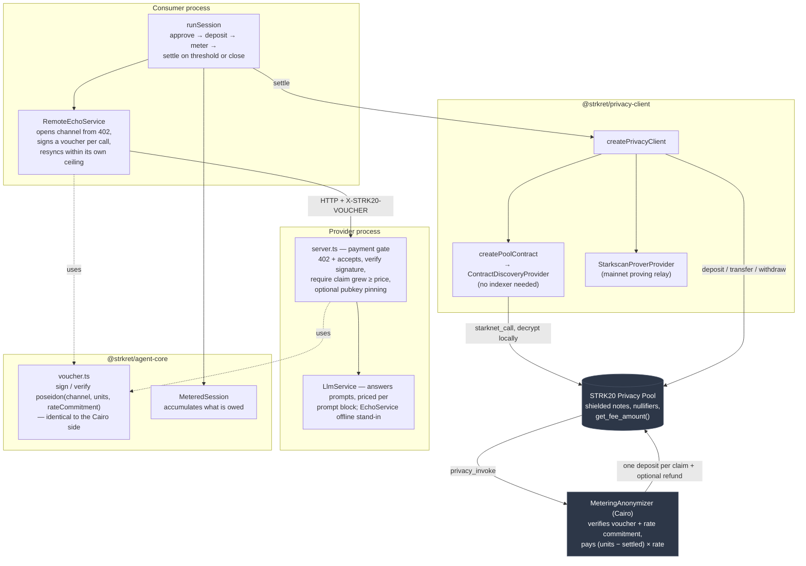

# Strkret

**Confidential, metered pay-per-use commerce between autonomous agents**, settled
privately on Starknet via [STRK20](https://strk20.starknet.io).

A consumer agent buys metered calls from a provider agent — priced and served
independently by the provider — and settles recorded usage through the
STRK20 privacy pool. Metering happens per call and off-chain; settlement is
batched. Encrypted transfers hide amounts inside the pool; the anonymizer
path exposes amounts and voucher inputs. This project is the
metering and settlement logic on top of it, and the reason those two are
deliberately separated is the first thing worth explaining.

## The problem: pay-per-use and confidentiality pull against each other

Confidential settlement is not free. Every settlement is an `apply_actions`
call on the pool, and the pool charges a flat protocol fee for it —
**6 STRK in the recorded mainnet run**, read from the deployed contract:

```
starknet_call → get_fee_amount() → 0x53444835ec580000 = 6 × 10^18
```

Flat, per call, regardless of how much value moves. Pay-per-use wants the
opposite: many small payments, one per API call. Put those together naively
and every API call would cost 6 STRK in protocol fees alone. That overwhelms
the console's current 0.0001 STRK per usage unit. Fees can change; read
`get_fee_amount()` before a new run.

So the question worth engineering is not "how do we pay privately per call",
it's:

> How do you keep per-call metering granularity while paying settlement cost
> only once?

## How Strkret answers it

By decoupling **metering** from **settlement**:

- **Metering is per-call and off-chain.** Before each HTTP call the consumer
  signs a voucher for its running cumulative total. The provider verifies it
  before serving and keeps an in-memory counter, not a durable voucher store.
  Signing adds no chain fee; inference and hosting still have costs.
- **Settlement is batched and on-chain.** One settlement
  covers a whole session, or fires when accrued value crosses a threshold.
  Because vouchers carry a cumulative total and the contract tracks a
  per-channel high-water mark, settling twice pays the delta, never the total
  twice.

The anonymizer verifies the signed units and rate commitment and computes
the payout from them. It does not lock a consumer's funds ahead of service,
force later payment, or prove that the service was delivered. The voucher
does not bind the token, recipient note, or deployment, so recipient routing
and settlement submission still require trust. This is a prototype for
batched metering, not a trustless payment channel.

The economics, stated plainly rather than hidden: at 6 STRK per settlement,
keeping the protocol fee at or below 5% of payment value needs ≥120 STRK
moving per settlement; 1% needs ≥600 STRK. Gas is additional. The advertised
`minSettlementUnits` is demo metadata, not a calculated or enforced break-even
threshold: it defaults to 600 usage units in the standalone provider and 1
in the console. At the console rate, 120 STRK means 1,200,000 usage units.

## What the mainnet run cost

Not a projection — this is the run recorded in `strk20.json`, measured from
the receipts (gas and pool fees in STRK):

| step | gas | pool fee | total |
| --- | ---: | ---: | ---: |
| provider register | 2.32 | 6.00 | 8.32 |
| consumer deposit | 2.44 | 6.00 | 8.44 |
| **12 metered calls** | **0** | **0** | **0** |
| anonymizer settle | 2.55 | 6.00 | 8.55 |
| | | | **25.31 STRK** |

These are the three recorded pool transactions, excluding prerequisite
token approvals, contract deployment, inference, and earlier attempts. The
receipts were rechecked on 2026-09-08; all three report `SUCCEEDED`.

The escrow moved was 1000 wei — about 1e-15 STRK. Economically nothing, and
that is the point: what costs money here is the fee, not the payment.

Read the middle row first. Twelve calls were served, priced and signed for
without a single transaction. Paying per call would have meant twelve
`apply_actions` at 6 STRK each — **72 STRK to move a rounding error**.
The recorded flow used three pool transactions. A longer session can keep
that transaction count if it still settles once; gas need not be identical.
The protocol fee is amortized across the calls.

The number metered off-chain and the number settled on-chain are the same
number only because that run used a rate of 1 wei per unit: 12 units metered,
12 wei credited to the provider's open note, and 988 wei to the refund note
out of 1000 wei. The open-note deposit events expose those amounts in the
[settlement transaction](https://voyager.online/tx/0x23e848a8a12f2509fa056b8f2d6ea595af2177bcd9cd564012c117ac75b5f6c).

Reproducing it, once `.env` points at mainnet (see "Running it for real"):

```bash
pnpm --filter @strkret/agent-consumer run demo:metered
```

The script chooses contract addresses and mainnet resource bounds from the
configured pool address. Mainnet requires `STARKSCAN_PROVER_KEY`; the client
selects the REST prover when that key is present. This script still labels
its provider terms and output evidence as mainnet, so use the dedicated
Sepolia scripts for testnet evidence. Set `CHANNEL_ID` to a channel this
consumer has not settled before, since the high-water mark persists on-chain per
`(consumer, channel)`. `SKIP_PROVIDER_REGISTER=1` skips step 1 once the
provider has registered — registration is permanent per account, and
re-running it can consume gas and prover capacity. The script overwrites
`strk20.json`'s transaction list and expects the provider's total discovered
balance to equal this run's payout;
existing provider notes can make that final assertion fail on a rerun.

## What's built

**Runs on mainnet.** Twelve metered calls served off-chain and settled once
through our own anonymizer contract, against the live STRK20 pool. Three
successful mainnet transactions, listed in `strk20.json`.

**The anonymizer contract** (`contracts/metering-anonymizer`) — 14/14 tests,
verified on devnet, Sepolia and mainnet. It verifies the consumer's
signature and rate commitment on-chain, enforcing the signed amount when
funded settlement is submitted. An in-repo security review is documented in
that package's README, including the two findings it fixed: an unenforced
settlement amount, and a reentrancy path through the caller-supplied token.

**Settlement is batched.** `privacy_invoke` takes a span of provider claims,
so a consumer using M providers pays them in one settlement instead of M. At
the recorded 6 STRK fee, the protocol fee is 6 rather than 6M; execution gas
can increase with batch size. The console currently submits one claim.

**Vouchers are incremental.** Each voucher carries a cumulative total and
the contract tracks a per-channel high-water mark, so settling twice pays
the delta rather than the total twice. Verified on Sepolia by reading
balances back from `discoverNotes()` between rounds rather than trusting the
run's own logs.

**The rate is enforced, not advertised.** The rate commitment lives inside
the signed message, so a voucher can only ever be settled at the rate its
consumer agreed to.

**No hosted indexer required.** Discovery runs off plain `starknet_call`s
against the pool and decrypts locally with the viewing key. The recorded
mainnet run used this route without a hosted indexer.
Verified equivalent to the hosted indexer on Sepolia, where both exist.

**The provider sells real work** — an agent answering prompts with a model,
priced per request, rather than a string reverser standing in for one. The
standalone HTTP provider supports optional consumer pubkey pinning, and its
consumer supports channel resync with a signing ceiling. Both sides ship
`selfcheck` scripts. The browser API accepts ephemeral signing keys and does
not verify a funded channel before serving inference.

**An x402-shaped handshake.** An unpaid call gets `402` plus `accepts`, and
every paid call carries a signed cumulative voucher. Deliberately not x402
proper — there is no per-request `X-PAYMENT` payload, because per-request
on-chain payment is exactly what the flat fee rules out.

## How deeply this uses STRK20

Not a wrapper around one helper call. The project touches the pool at four
levels, with a custom prover and the SDK's contract-based discovery provider.

**Core pool operations.** `register` publishes a public viewing key, `deposit`
shields the escrow, `withdraw` releases it to the anonymizer, and `transfer`
credits a provider directly on the simpler settlement path. All four run on
mainnet or Sepolia in the demos, not just in tests.

**Shielded balances, handled properly.** Notes, nullifiers and viewing keys
are the substrate the whole design sits on. Balances are read back by
decrypting notes with the viewing key — `discoverNotes()` — which is how the
incremental-voucher test verifies the high-water mark rather than trusting
its own logs. Note maturity is respected explicitly: proofs are generated
against `head − 10`, because proving against an immature note surfaces later
as a baffling "insufficient allowance" on a deposit that just approved.

**Our own anonymizer contract.** `MeteringAnonymizer` is Cairo we wrote,
declared and deployed to mainnet, and invoked by the pool through
`privacy_invoke`. It receives a span of provider claims, verifies each
consumer signature and rate commitment on-chain, pays
`(units − already_settled) × rate`, and returns one `OpenNoteDeposit` per
claim plus a refund deposit only when a remainder exists.
This is the integration point the pool is designed to expose, and using it is
what enforces the batch's signed amounts.

**SDK extension points.** The client combines:

- `StarkscanProverProvider` implements `ProofProviderInterface` against
  Starkscan's REST proving relay used by the recorded mainnet run.
  Job queue, polling with backoff, and L1→L2 message decoding.
- Discovery uses the SDK's `ContractDiscoveryProvider`, reading the pool over
  plain `starknet_call` and decrypting locally — so no hosted indexer is
  needed. Our `createPoolContract` supplies its ABI-backed pool interface.

**Two settlement paths, with different privacy trade-offs**, both working:

| | plain `transfer` | via the anonymizer |
| --- | --- | --- |
| amounts | hidden | public |
| open-note amounts | not used | public |
| voucher inputs | not submitted | rate, units, channel, key and signature public |
| payout calculation | chosen by sender | signed units and rate checked on-chain |

Pool notes conceal their owners, but transaction senders, public deposits
and withdrawals, setup activity, and timing can reveal links. The recorded
SDK run submitted directly from the consumer account: it is evidence of
settlement execution, not sender anonymity. Reusing a voucher key also links
contract settlements. The provider sees prompts and vouchers; the console's
relayer additionally receives the refund wallet address.

The design uses pool-note recipients rather than shadow accounts.

## Why no bespoke ZK circuit

The obvious design is a custom circuit proving "settlement = usage × rate"
without revealing usage or rate. STRK20 already solves the harder half of
that generically: encrypted notes hide their owners, token and amount inside
the pool. Public transaction metadata and helper calldata remain separate
privacy concerns. This project reuses the pool's proof system.

So the confidentiality guarantee is STRK20's, not ours. What this project
adds is the cheap half: **STARK-curve signatures and a Poseidon rate
commitment**, which is ordinary applied cryptography rather than a circuit.
A voucher adds no chain fee to sign or verify, which is why metering can
happen on every call while proving stays where it belongs — inside the
pool's own settlement, once per batch.

Worth being precise: the private note state and proof system come from the
pool; deposits themselves are public. The *metering integrity* is
signatures and commitments, and is not zero-knowledge — a voucher reveals
the unit count to whoever holds it. The anonymizer's submitted calldata
publishes the voucher fields and rate witnesses; they are not private proof
inputs in this implementation.

## Anonymizer contract: `settlement` public, correctness enforced

The STRK20 anonymizer at
[`contracts/metering-anonymizer`](contracts/metering-anonymizer) is **draft,
reviewed in-repo, not independently audited**, with recorded settlements on
Sepolia and mainnet. As an alternative to plain `transfer()`, it verifies the
consumer's signed usage voucher and the `rate_commitment` on-chain, computes
`settlement = (total_units − already_settled) × rate` itself — paying only
what this channel hasn't already settled — and splits the escrowed deposit
into `settlement -> provider` and `refund -> consumer` in one atomic call —
so the settlement amount is enforced on-chain rather than trusted, which a
bare `transfer()` doesn't give you.

The real tradeoff, worth stating precisely: `privacy_invoke`'s output lands
in a public-amount "open note" — structural, not a workaround. So this path
trades public token amounts and voucher inputs for checked payout arithmetic.
An open note conceals its owner; it does not erase information leaked by the
transaction sender or other public activity. Plain `transfer()` also hides
the transferred amount inside the pool.

Neither path needs a shadow account for the provider-gets-`owed`,
consumer-keeps-the-remainder split: `surplusTo(...)` handles encrypted change
on the SDK transfer path; the anonymizer returns a refund note when needed.

## How it fits together

The standalone agent/SDK demos use these pieces. The browser has a separate
wallet → public relayer funding → backend settlement flow, described below.



Metering and signatures add no chain transactions; inference and hosting
still cost money. Registration, deposits and settlements call the pool and
can incur protocol fees; token approvals are separate on-chain transactions.

```mermaid
sequenceDiagram
    participant C as Consumer process
    participant P as Provider process (HTTP)
    participant Pool as STRK20 Privacy Pool
    participant Anon as Metering Anonymizer (optional)

    Note over P,Pool: on-chain, once ever
    P->>Pool: approve fee allowance, register public viewing key

    Note over C,P: channel open — x402-shaped, no chain contact
    C->>P: POST /call (no voucher)
    P-->>C: 402 Payment Required + accepts{rate, channelId,<br/>rateCommitment, minSettlementUnits}

    C->>Pool: approve allowance, deposit escrow
    Note over C,Pool: deposit is public; notes need maturity before spending

    Note over C,P: metering — per call, no chain fee
    loop N calls
        C->>C: sign voucher(channelId, cumulative units, rateCommitment)
        C->>P: POST /call + X-STRK20-VOUCHER
        P->>P: verify sig, require claim grew by ≥ price
        P-->>C: { completion, cost, claimedUnits }
    end
    Note over P: verifies signed usage; payment still needs funded submission

    Note over C,Pool: settlement — wait for mature notes (~10 blocks)

    alt plain transfer — amount hidden too
        C->>Pool: transfer(owed since last settlement)
        Pool-->>P: encrypted note credited
        Note over C,Pool: note owners and transfer amount hidden;<br/>submitting account remains public
    else anonymizer — correctness enforced on-chain
        C->>Pool: withdraw(escrow) → Anon
        Pool->>Anon: privacy_invoke(span of claims, one per provider)
        Anon->>Anon: per claim: check sig over the commitment,<br/>pay (units − settled) × rate
        Anon-->>Pool: One deposit per claim + optional refund
        Pool-->>P: settlement to each provider (amounts public)
        Pool-->>C: refund (amount public)
        Note over Anon,Pool: voucher inputs public; mark advances
    end

    Note over C,Pool: runSession can transfer at a threshold or close;<br/>anonymizer demos exercise a separate settlement path
```

A pnpm workspace, TypeScript project references throughout:

- **`packages/privacy-client`** (`@strkret/privacy-client`) — thin wrapper
  around `@starkware-libs/starknet-privacy-sdk`'s `createPrivateTransfers`:
  builds an `Account`, wires the viewing-key/proving/discovery providers, and
  exposes the register → deposit → transfer submission tail every operation
  shares (back off `provingBlockId`, spread proof details only when present,
  `tip: 0n`, wait for inclusion).
- **`packages/agent-core`** (`@strkret/agent-core`) — the priced
  `Service<Req, Res>` interface, `MeteredSession` (accumulates what's owed,
  off-chain), `voucher.ts` (signing and verification of cumulative usage
  vouchers, plus the `accepts` payment-requirements shape the 402 carries),
  and `runSession`: the approve → register → approve → deposit → meter →
  wait-for-maturity → settle flow, generic over whatever `Service` and
  `PrivacyClient`s it's given. Pass `settlementThreshold` to settle
  mid-session once enough value has accrued instead of only at close.

  The voucher's signed message is `poseidon(channel_id, total_units, rate_commitment)` —
  byte-identical to what the Cairo contract verifies. A mismatch there
  wouldn't fail at the HTTP boundary; it would fail on-chain at settlement,
  after the work was already served.
- **`agents/provider`** (`@strkret/agent-provider`) — what is actually being
  sold, plus the payment gate in front of it. `LlmService` answers prompts
  with a real model and prices per block of prompt characters;
  `EchoService` is the deterministic offline stand-in. The provider picks
  between them by whether `OPENAI_API_KEY` is set — the fallback is not a
  courtesy, since the devnet demos and both selfchecks have to run
  reproducibly without a paid key for anyone cloning this. `server.ts`: runs the
  provider as its own HTTP process with the payment gate in front of it. An
  unpaid `POST /call` gets `402` and the terms; a paid one must carry a
  voucher whose claim has grown by at least this call's price. The provider
  prices independently and never trusts a consumer-claimed cost.
  `pnpm --filter @strkret/agent-provider run selfcheck` asserts the gate
  refuses unpaid, forged, stale, cross-key and wrong-channel vouchers.
- **`agents/consumer`** (`@strkret/agent-consumer`) — `demo.ts` runs
  `runSession` against real infra from the repo-root `.env`, with an optional
  hosted indexer, and overwrites `strk20.json` (including its URL fields).
  Use `demo:metered` for the recorded mainnet path and its explicit resource
  bounds; the basic `demo` does not supply those bounds.
  `demo-devnet.ts` runs the same flow against a disposable local Starknet
  devnet — no external services, no `.env`. `demo-networked-devnet.ts` is
  the same again, except the provider is a genuinely separate OS process
  (`remote-echo-service.ts` talks to it over real HTTP instead of calling
  `EchoService` in-process) — spawned automatically so it's still one
  command, but it's two real processes underneath, not two classes in one.
  `demo:metered` produced the recorded mainnet evidence. The other scripts
  exercise individual settlement and metering paths.

## Running it against a local devnet

Use Node 24+ and pnpm. Installing the pinned Privacy SDK requires GitHub
Packages access (see setup below); building devnet artifacts also downloads
Cairo source and dependencies. Once installed, the devnet demo needs no
funded account or hosted prover credentials.

```bash
pnpm install
asdf install starknet-devnet 0.8.2 && asdf set starknet-devnet 0.8.2  # pinned in .tool-versions
./scripts/build-devnet-artifacts.sh   # see the script for why this is needed
pnpm -r build
pnpm --filter @strkret/agent-consumer run demo:devnet
```

Verified working end-to-end: register → deposit → meter 3 calls → wait out
note maturity → settle with one private transfer, all against the real
Cairo privacy-pool contract, locally. These infra issues surfaced doing this
and are worth knowing about if you hit them again after a dependency bump:

- `snforge test` must run **inside** `contracts/metering-anonymizer/`. It is a
  separate Scarb project pinning Scarb `2.18.0` in its own `.tool-versions`,
  so running it from the repo root picks up whatever Scarb is global and
  fails with "Scarb Version X doesn't satisfy minimal 2.13.1". That message
  reads as "upgrade Scarb", but the right version is already installed — it
  is just not active in the directory you are standing in.
- The SDK pins `starknet.js` at `10.5.0`; letting npm resolve a different
  top-level `starknet` version installs two copies with incompatible types.
  Keep `package.json`'s `starknet` version exactly matching whatever
  `node_modules/@starkware-libs/starknet-privacy-sdk`'s own dependency says.
- `starknet-devnet 0.7.2` (the SDK's own declared dependency range) doesn't
  support the `--proof-mode` flag the SDK passes; `0.9.2` supports the flag
  but rejects the SDK's proof-fact format as an unsupported protocol
  version. `0.8.2` is the version that actually works with
  `starknet-privacy-sdk@0.14.3-rc.5` — not documented anywhere, found by
  bisecting.
- The documented `POST /create_block` REST endpoint 404s on this devnet
  build; the `devnet_createBlock` JSON-RPC method (undocumented, found by
  trial) does the same thing and actually works — see the `onWaitTick` hook
  in `demo-devnet.ts`.

**Networked variant** — same on-chain flow, but the provider runs as its
own process and the consumer talks to it over real HTTP:

```bash
pnpm --filter @strkret/agent-consumer run demo:networked-devnet
```

This spawns `agent-provider`'s `serve` script as a child process (so it's
still one command, and a judge doesn't need two terminals to see it work),
waits for `GET /terms` to respond, then runs the consumer against it
exactly like `demo:devnet` — except every metered call is a real
`POST /call` over `localhost`, not an in-process method call. Two real OS
processes, real HTTP between them; the script just starts both for you.

## Running it in a browser

A wallet console defaulting to mainnet. Set `OPENAI_API_KEY` in the repo-root
`.env` (and optionally `OPENAI_MODEL`) and configure the relayer credentials
and funds listed in [web/README.md](web/README.md#relayer-configuration).
Then run:

```bash
pnpm --filter @strkret/agent-core run build
pnpm --filter @strkret/agent-provider run build
pnpm --filter @strkret/web run dev   # http://localhost:3100
```

Connect Ready, shield funds, and ask questions. Each started block of 100
prompt characters (JavaScript `prompt.length`) costs one usage unit at
**0.0001 STRK**; three short prompts accrue **0.0003 STRK** before fees.
The current shield button deposits the
configured fee buffer: **10 STRK on mainnet, 6 on Sepolia**. It does not include
the usage amount or wallet operation fees, so that deposit alone is not
enough for settlement from an otherwise empty private balance.

**Settle now** asks the wallet to withdraw usage value plus the fee buffer
to the relayer's public address, waits for confirmation and ten more blocks,
then calls `/api/relay-settle`. The backend verifies the voucher and submits
`privacy_invoke` using its own pre-existing shielded reserve. The public
withdrawal does not create a shielded note for the relayer; the current
backend neither re-shields that funding nor checks a funding receipt. The
full visitor-funded flow is therefore incomplete, and the fee-buffer surplus
is not refunded. A failure after funding does not undo that withdrawal.

The contract checks signed payout arithmetic, but the browser's ephemeral
voucher key does not authorize debiting its wallet or guarantee payment.
Withdrawals and helper amounts are public. The console serves inference via
Next.js API routes and does not need the devnet session server. Use
`NEXT_PUBLIC_STRK20_NETWORK=sepolia` when starting dev or building to select
testnet; the supplied Sepolia HTTP RPC is suitable for local HTTP testing,
not an HTTPS-hosted browser app.

See [`web/README.md`](web/README.md) for Docker deployment and verification.

## Running it for real (Sepolia or mainnet)

```bash
cp .env.example .env   # fill in RPC, pool/token addresses, both accounts' keys
pnpm -r build
pnpm --filter @strkret/agent-consumer run demo  # plain-transfer path; see mainnet note above
```

**Before filling in `.env`:**

- `POOL_ADDRESS` / `TOKEN_ADDRESS` — confirm the current pool address for
  the network you're targeting, and a supported token, from
  [strk20-by-example.org](https://strk20-by-example.org) first. Don't guess
  these; a wrong pool address fails silently in confusing ways. Mainnet pool:
  `0x040337b1af3c663e86e333bab5a4b28da8d4652a15a69beee2b677776ffe812a`.
- `RPC_URL` — use a node that accepts writes and supports the STRK20 proof
  extension. The recorded mainnet run used
  `https://mainnet.nodes.starknet.org/rpc/v0_10`. Earlier attempts encountered
  proof-fact hashing/signature incompatibilities and unsupported submission
  methods on other nodes. Fee estimation also failed on this integration,
  so `demo:metered` and the mainnet web relayer pass explicit resource bounds
  to bypass it. Those are fixed ceilings, not current fee quotes; review
  `BOUNDS_MAINNET` before sending real funds.
- `PROVING_SERVICE_URL` — a hosted prover. The recorded Sepolia runs used one
  from the STRK20 team (not publicly documented; ask in their Telegram).
  For the recorded **mainnet** route, set `STARKSCAN_PROVER_KEY` and use
  `https://api.starkscan.co/v1/SN_MAIN` as `PROVING_SERVICE_URL`. This selects
  `StarkscanProverProvider`. The pilot limit during that run was 10 proofs/day
  per key; verify current service limits before rerunning.
- `INDEXER_URL` — **optional.** Left empty, discovery runs off plain
  `starknet_call`s against the pool and decrypts locally with the viewing
  key, so no hosted indexer is needed on any network. Verified equivalent to
  the hosted one on Sepolia, where both exist. Set it only if you have one
  and want to spare the RPC volume.
- `OPENAI_API_KEY` — optional for the standalone provider, which falls back
  to echo when absent; required for browser inference. The basic `demo` always
  uses `EchoService`. Chain demos still need their RPC and proving services.
  `OPENAI_MODEL` defaults to `gpt-5.4-mini`; the implementation sends
  `max_completion_tokens`.
- `CONSUMER_VIEWING_KEY` / `PROVIDER_VIEWING_KEY` — parsed with JavaScript
  `BigInt`, which accepts decimal and `0x` hexadecimal. Use the exact key
  registered for that account; changing its numeric value loses note access.
- This workspace uses **Node ≥ 24**. The pinned SDK is installed from GitHub
  Packages:
  ```bash
  gh auth refresh -h github.com -s read:packages
  npm config set @starkware-libs:registry https://npm.pkg.github.com
  npm config set '//npm.pkg.github.com/:_authToken' "$(gh auth token)"
  ```

## Testing on Sepolia

Sepolia is where everything is verified end to end against real infra — real
pool, real prover, real proofs — without spending mainnet money. Work
outward: the first two need no network at all, and each step proves
something the next one assumes.

**1. No network — logic and the payment gate**

```bash
pnpm -r build
(cd contracts/metering-anonymizer && snforge test)   # 14 tests — must run inside that dir
pnpm --filter @strkret/agent-provider run selfcheck  # gate refuses bad vouchers
pnpm --filter @strkret/agent-consumer run selfcheck  # consumer refuses to over-sign
```

The contract suite signs with real starknet.js vectors, so it proves the
Cairo and TypeScript sides agree on `poseidon(channel_id, total_units, rate_commitment)` —
not merely that the Cairo compiles.

**2. Local devnet — the whole flow, no credentials**

```bash
asdf install starknet-devnet 0.8.2 && asdf set starknet-devnet 0.8.2
./scripts/build-devnet-artifacts.sh
pnpm --filter @strkret/agent-consumer run demo:devnet             # plain transfer
pnpm --filter @strkret/agent-consumer run demo:invoke-devnet      # anonymizer path
pnpm --filter @strkret/agent-consumer run demo:networked-devnet   # 402 + vouchers + threshold
```

The networked one is the interesting demo: two real OS processes, a 402
handshake, a signed voucher per call, and — with a threshold of 20 against
30 owed — **two** settlements rather than one.

**3. Sepolia — real infra**

Fill `.env` first (see above; `INDEXER_URL` can stay empty). Both accounts
need STRK for deposits, gas and protocol fees. The recorded Sepolia fee was
2 STRK per pool transaction; the SDK demos read it from the pool. The web
console's fee buffer is separately hardcoded.

```bash
pnpm --filter @strkret/agent-consumer run demo                    # plain transfer path
pnpm --filter @strkret/agent-consumer run demo:invoke-sepolia     # anonymizer, one settlement
pnpm --filter @strkret/agent-consumer run demo:incremental-sepolia # two settlements, delta only
pnpm --filter @strkret/agent-consumer run check:discovery         # indexer vs contract discovery
```

What each is actually evidence of:

| Command | Proves |
|---|---|
| `demo` | plain `transfer()` settlement works against the real pool |
| `demo:invoke-sepolia` | the contract computes and enforces the settlement on-chain |
| `demo:incremental-sepolia` | a second voucher on one channel pays the **delta**, not the total again |
| `check:discovery` | contract discovery finds exactly what the hosted indexer does |

`demo:incremental-sepolia` is the one worth reading the output of. It runs
two rounds on the same channel — cumulative 100 then 150 — and asserts the
provider is credited `+500` then `+250`, reading the balance back from
`discoverNotes()` between rounds rather than trusting its own logs. If the
high-water mark ever regressed, that second number would read `750`.

**Expect it to be slow.** Every settlement waits ~10 blocks for note
maturity; proving and RPC latency add time. The earlier two-round run took
20–30 minutes. That wait
is not incidental: skipping it is what surfaces as a baffling "insufficient
allowance" on a deposit that just approved.

**Reruns:** bump `CHANNEL_ID` in `demo-incremental-sepolia.ts`. The
high-water mark persists on-chain per `(consumer, channel)`, so a channel
already settled at 150 will reject a fresh run starting at 100 — correctly,
that is the replay guard doing its job.

## License

Apache-2.0 — see [LICENSE](LICENSE).
