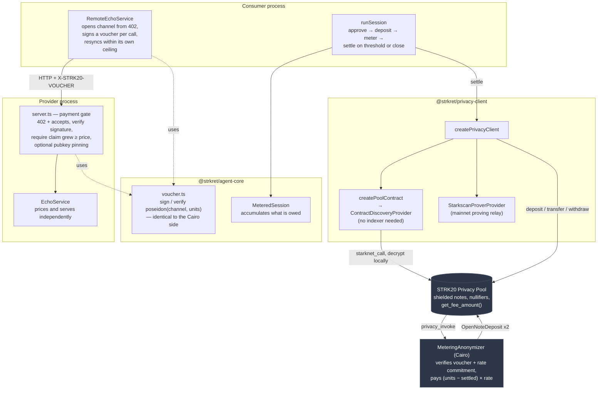
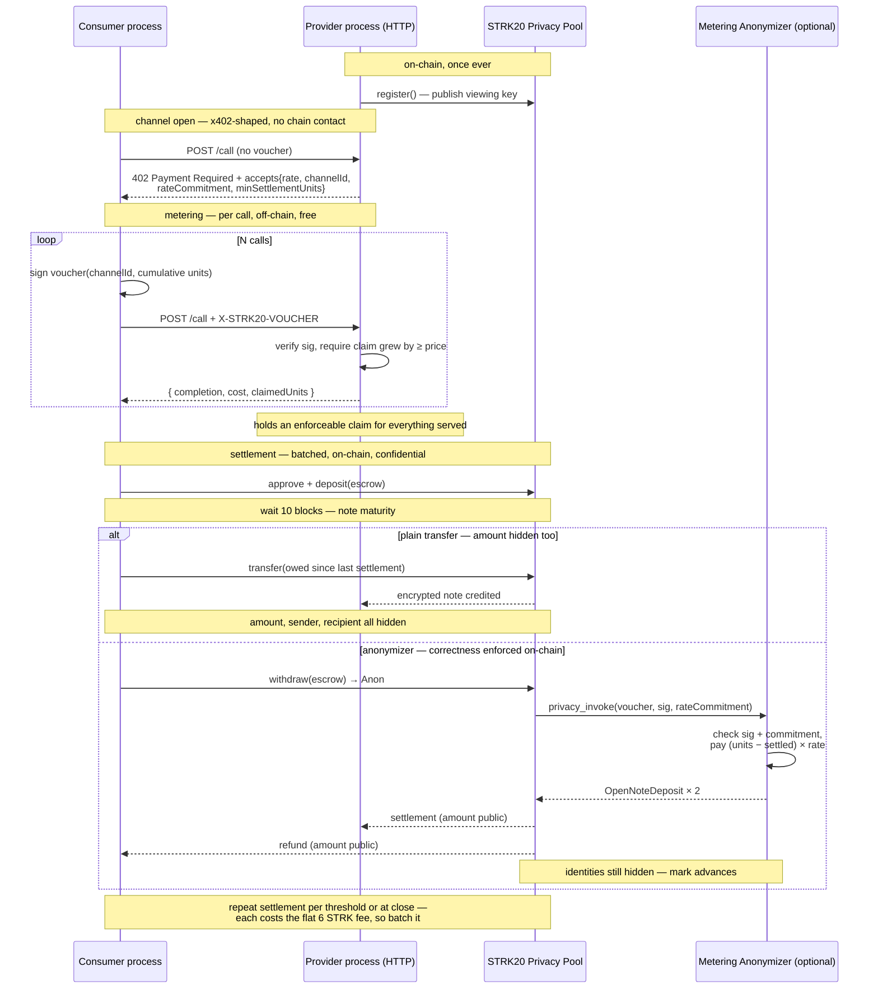

# Strkret

**Confidential, metered pay-per-use commerce between autonomous agents**, settled
privately on Starknet via [STRK20](https://strk20.starknet.io).

A consumer agent buys metered calls from a provider agent — priced and served
independently by the provider — and pays for exactly what it used through the
STRK20 privacy pool. Metering happens per call and off-chain; settlement is
batched and shielded. Confidentiality is the pool's job; this project is the
metering and settlement logic on top of it, and the reason those two are
deliberately separated is the first thing worth explaining.

## The problem: pay-per-use and confidentiality pull against each other

Confidential settlement is not free. Every settlement is an `apply_actions`
call on the pool, and the pool charges a flat protocol fee for it —
**6 STRK on mainnet**, read straight off the deployed contract:

```
starknet_call → get_fee_amount() → 0x53444835ec580000 = 6 × 10^18
```

Flat, per call, regardless of how much value moves. Pay-per-use wants the
opposite: many small payments, one per API call. Put those together naively
and every API call costs 6 STRK to settle, which no per-call price can
absorb. **Shielded micropayments, done the obvious way, do not exist as a
product.**

So the question worth engineering is not "how do we pay privately per call",
it's:

> How do you keep per-call metering granularity while paying settlement cost
> only once?

## How Strkret answers it

By decoupling **metering** from **settlement**:

- **Metering is per-call, off-chain, and free.** After each call the consumer
  signs a voucher for its running cumulative total, and the provider keeps
  the highest one. Signing and verifying cost nothing and touch no chain, so
  the provider holds an enforceable claim for everything it has served — it
  is never serving on trust and hoping for a voucher at the end.
- **Settlement is batched, on-chain, and confidential.** One settlement
  covers a whole session, or fires when accrued value crosses a threshold.
  Because vouchers carry a cumulative total and the contract tracks a
  per-channel high-water mark, settling twice pays the delta, never the total
  twice.

The anonymizer contract is what makes that decoupling safe rather than merely
cheap: it verifies the consumer's signature and the rate commitment on-chain,
so the provider cannot inflate usage and the consumer cannot repudiate it.
Per-call accountability, per-session settlement cost.

The batching idea itself is old — payment channels and rollups amortise the
same way. What is specific here is the combination: **metering correctness
verified inside a shielded settlement**, so batching doesn't require trusting
either party.

The economics, stated plainly rather than hidden: at 6 STRK per settlement,
keeping the fee under 5% overhead needs ≥120 STRK moving per settlement, and
under 1% needs ≥600 STRK. The provider advertises a `minSettlementUnits` in
its terms for exactly this reason — below it, settling costs more than the
work is worth, and the consumer should know that before it starts spending
rather than discover it at settlement.

## Why no bespoke ZK circuit

The obvious design is a custom circuit proving "settlement = usage × rate"
without revealing usage or rate. STRK20 already solves the harder half of
that generically — every private transfer through its pool hides sender,
recipient, token and amount behind a native STARK proof. Rebuilding that
would be reimplementing the pool badly.

So the confidentiality guarantee is STRK20's, not ours. What this project
adds is the cheap half: **STARK-curve signatures and a Poseidon rate
commitment**, which is ordinary applied cryptography rather than a circuit.
A voucher costs nothing to sign or verify, which is exactly why metering can
happen on every call while proving stays where it belongs — inside the
pool's own settlement, once per batch.

Worth being precise, since these are easy to conflate: the *shielding* is
zero-knowledge and comes from the pool. The *metering integrity* is
signatures and commitments, and is not zero-knowledge — a voucher reveals
the unit count to whoever holds it, which is only ever the two parties to
the channel.

## Anonymizer contract: `settlement` public, correctness enforced

A STRK20 anonymizer (`privacy_invoke`) contract lives at
[`contracts/metering-anonymizer`](contracts/metering-anonymizer) — **draft,
unreviewed**, deployed and verified end-to-end on Sepolia (see that
package's README for the review still needed before mainnet). It's an
alternative settlement path to
the plain `transfer()` above, not a replacement: it verifies the consumer's
signed usage voucher and the `rate_commitment` on-chain, computes
`settlement = (total_units − already_settled) × rate` itself — paying only
what this channel hasn't already settled — and splits the escrowed deposit
into `settlement -> provider` and `refund -> consumer` in one atomic call —
so the settlement amount is enforced on-chain rather than trusted, which a
bare `transfer()` doesn't give you.

The real tradeoff, worth stating precisely: `privacy_invoke`'s output lands
in a public-amount "open note" — structural, not a workaround. So this path
trades a **public settlement amount** for on-chain-enforced correctness,
while still hiding both parties' **identity**, since an open note hides its
owner. Plain `transfer()` hides the amount too, and is the better choice
whenever that enforcement isn't worth making the amount public.

Neither path needs a shadow account for the provider-gets-`owed`,
consumer-keeps-the-remainder split: `surplusTo(...)` on the `transfer()`
path and the two-`OpenNoteDeposit` return on the anonymizer path each give
that for free from primitives that exist for other reasons.

## How it fits together

The pieces, and which of them ever touches the chain:



Everything above the pool line is free and off-chain. Only `runSession`'s
settle step and the one-time `register`/`deposit` cross into the shaded
boxes, and each crossing pays the flat protocol fee — which is why the
metering loop deliberately never does.



A pnpm workspace, TypeScript project references throughout:

- **`packages/privacy-client`** (`@strkret/privacy-client`) — thin wrapper
  around `@starkware-libs/starknet-privacy-sdk`'s `createPrivateTransfers`:
  builds an `Account`, wires the viewing-key/proving/discovery providers, and
  exposes the register → deposit → transfer submission tail every operation
  shares (back off `provingBlockId`, spread proof details only when present,
  `tip: 0n`, wait for inclusion).
- **`packages/agent-core`** (`@strkret/agent-core`) — the priced
  `Service<Req, Res>` interface, `MeteredSession` (accumulates what's owed,
  off-chain), `voucher.ts` (signing and verification of cumulative usage
  vouchers, plus the `accepts` payment-requirements shape the 402 carries),
  and `runSession`: the register → approve → deposit → meter →
  wait-for-maturity → settle flow, generic over whatever `Service` and
  `PrivacyClient`s it's given. Pass `settlementThreshold` to settle
  mid-session once enough value has accrued instead of only at close.

  The voucher's signed message is `poseidon(channel_id, total_units)` —
  byte-identical to what the Cairo contract verifies. A mismatch there
  wouldn't fail at the HTTP boundary; it would fail on-chain at settlement,
  after the work was already served.
- **`agents/provider`** (`@strkret/agent-provider`) — owns the concrete
  `EchoService`, the deterministic demo service, and `server.ts`: runs the
  provider as its own HTTP process with the payment gate in front of it. An
  unpaid `POST /call` gets `402` and the terms; a paid one must carry a
  voucher whose claim has grown by at least this call's price. The provider
  prices independently and never trusts a consumer-claimed cost.
  `pnpm --filter @strkret/agent-provider run selfcheck` asserts the gate
  refuses unpaid, forged, stale, cross-key and wrong-channel vouchers.
- **`agents/consumer`** (`@strkret/agent-consumer`) — `demo.ts` runs
  `runSession` against real infra (RPC, Sepolia or mainnet, a real prover +
  indexer) from the repo-root `.env`, and writes `strk20.json`.
  `demo-devnet.ts` runs the same flow against a disposable local Starknet
  devnet — no external services, no `.env`. `demo-networked-devnet.ts` is
  the same again, except the provider is a genuinely separate OS process
  (`remote-echo-service.ts` talks to it over real HTTP instead of calling
  `EchoService` in-process) — spawned automatically so it's still one
  command, but it's two real processes underneath, not two classes in one.
  `demo.ts` / `demo-devnet.ts` are what actually count for submission;
  the others are dev loops and architecture demonstrations.

## Running it against a local devnet (no credentials needed)

```bash
pnpm install
asdf install starknet-devnet 0.8.2 && asdf set starknet-devnet 0.8.2  # pinned in .tool-versions
./scripts/build-devnet-artifacts.sh   # see the script for why this is needed
pnpm -r build
pnpm --filter @strkret/agent-consumer run demo:devnet
```

Verified working end-to-end: register → deposit → meter 3 calls → wait out
note maturity → settle with one private transfer, all against the real
Cairo privacy-pool contract, locally. Three infra issues surfaced doing this
and are worth knowing about if you hit them again after a dependency bump:

- The SDK pins `starknet.js` at `10.5.0`; letting npm resolve a different
  top-level `starknet` version installs two copies with incompatible types.
  Keep `package.json`'s `starknet` version exactly matching whatever
  `node_modules/@starkware-libs/starknet-privacy-sdk`'s own dependency says.
- `starknet-devnet 0.7.2` (the SDK's own declared dependency range) doesn't
  support the `--proof-mode` flag the SDK passes; `0.9.2` supports the flag
  but rejects the SDK's proof-fact format as an unsupported protocol
  version. `0.8.2` is the version that actually works with
  `starknet-privacy-sdk@0.14.3-rc.5` — not documented anywhere, found by
  bisecting.
- The documented `POST /create_block` REST endpoint 404s on this devnet
  build; the `devnet_createBlock` JSON-RPC method (undocumented, found by
  trial) does the same thing and actually works — see the `onWaitTick` hook
  in `demo-devnet.ts`.

**Networked variant** — same on-chain flow, but the provider runs as its
own process and the consumer talks to it over real HTTP:

```bash
pnpm --filter @strkret/agent-consumer run demo:networked-devnet
```

This spawns `agent-provider`'s `serve` script as a child process (so it's
still one command, and a judge doesn't need two terminals to see it work),
waits for `GET /terms` to respond, then runs the consumer against it
exactly like `demo:devnet` — except every metered call is a real
`POST /call` over `localhost`, not an in-process method call. Two real OS
processes, real HTTP between them; the script just starts both for you.

## Running it for real (Sepolia or mainnet)

```bash
cp .env.example .env   # fill in RPC, pool/token addresses, both accounts' keys
pnpm --filter @strkret/agent-consumer run demo
```

**Before filling in `.env`:**

- `POOL_ADDRESS` / `TOKEN_ADDRESS` — confirm the current pool address for
  the network you're targeting, and a supported token, from
  [strk20-by-example.org](https://strk20-by-example.org) first. Don't guess
  these; a wrong pool address fails silently in confusing ways. Mainnet pool:
  `0x040337b1af3c663e86e333bab5a4b28da8d4652a15a69beee2b677776ffe812a`.
- `PROVING_SERVICE_URL` — a hosted prover. We have a working Sepolia one
  from the STRK20 team (not publicly documented; ask in their Telegram).
  For **mainnet** there is no JSON-RPC prover, but Starkscan runs a REST
  relay in front of one — set `starkscanProverApiKey` on the client instead
  and `provingServiceUrl` becomes the relay base URL. Their API is
  pilot-phase: 10 proofs/day per key, and it will not serve
  `deploy_account`.
- `INDEXER_URL` — **optional.** Left empty, discovery runs off plain
  `starknet_call`s against the pool and decrypts locally with the viewing
  key, so no hosted indexer is needed on any network. Verified equivalent to
  the hosted one on Sepolia, where both exist. Set it only if you have one
  and want to spare the RPC volume.
- `CONSUMER_VIEWING_KEY` / `PROVIDER_VIEWING_KEY` — must be a decimal
  `BigInt` string, not hex. A hex string compiles fine but derives the wrong
  channel keys, and notes sent to that account never decrypt.
- The SDK needs **Node ≥ 24** and currently isn't on npmjs — install it from
  GitHub Packages:
  ```bash
  gh auth refresh -h github.com -s read:packages
  npm config set @starkware-libs:registry https://npm.pkg.github.com
  npm config set '//npm.pkg.github.com/:_authToken' "$(gh auth token)"
  ```

## Testing on Sepolia

Sepolia is where everything is verified end to end against real infra — real
pool, real prover, real proofs — without spending mainnet money. Work
outward: the first two need no network at all, and each step proves
something the next one assumes.

**1. No network — logic and the payment gate**

```bash
pnpm -r build
(cd contracts/metering-anonymizer && snforge test)   # 8 tests
pnpm --filter @strkret/agent-provider run selfcheck  # gate refuses bad vouchers
pnpm --filter @strkret/agent-consumer run selfcheck  # consumer refuses to over-sign
```

The contract suite signs with real starknet.js vectors, so it proves the
Cairo and TypeScript sides agree on `poseidon(channel_id, total_units)` —
not merely that the Cairo compiles.

**2. Local devnet — the whole flow, no credentials**

```bash
asdf install starknet-devnet 0.8.2 && asdf set starknet-devnet 0.8.2
./scripts/build-devnet-artifacts.sh
pnpm --filter @strkret/agent-consumer run demo:devnet             # plain transfer
pnpm --filter @strkret/agent-consumer run demo:invoke-devnet      # anonymizer path
pnpm --filter @strkret/agent-consumer run demo:networked-devnet   # 402 + vouchers + threshold
```

The networked one is the interesting demo: two real OS processes, a 402
handshake, a signed voucher per call, and — with a threshold of 20 against
30 owed — **two** settlements rather than one.

**3. Sepolia — real infra**

Fill `.env` first (see above; `INDEXER_URL` can stay empty). Both accounts
need STRK for the deposit and the protocol fee, which is 2 STRK per
settlement on Sepolia — the code reads that from the pool rather than
assuming it.

```bash
pnpm --filter @strkret/agent-consumer run demo                    # plain transfer path
pnpm --filter @strkret/agent-consumer run demo:invoke-sepolia     # anonymizer, one settlement
pnpm --filter @strkret/agent-consumer run demo:incremental-sepolia # two settlements, delta only
pnpm --filter @strkret/agent-consumer run check:discovery         # indexer vs contract discovery
```

What each is actually evidence of:

| Command | Proves |
|---|---|
| `demo` | plain `transfer()` settlement works against the real pool |
| `demo:invoke-sepolia` | the contract computes and enforces the settlement on-chain |
| `demo:incremental-sepolia` | a second voucher on one channel pays the **delta**, not the total again |
| `check:discovery` | contract discovery finds exactly what the hosted indexer does |

`demo:incremental-sepolia` is the one worth reading the output of. It runs
two rounds on the same channel — cumulative 100 then 150 — and asserts the
provider is credited `+500` then `+250`, reading the balance back from
`discoverNotes()` between rounds rather than trusting its own logs. If the
high-water mark ever regressed, that second number would read `750`.

**Expect it to be slow.** Every settlement waits ~10 blocks for note
maturity, so a two-round run is 20–30 minutes of mostly waiting. That wait
is not incidental: skipping it is what surfaces as a baffling "insufficient
allowance" on a deposit that just approved.

**Reruns:** bump `CHANNEL_ID` in `demo-incremental-sepolia.ts`. The
high-water mark persists on-chain per `(consumer, channel)`, so a channel
already settled at 150 will reject a fresh run starting at 100 — correctly,
that is the replay guard doing its job.

## Status

- [x] Metering + settlement logic against the Privacy SDK
- [x] Verified end-to-end against a local devnet (real pool contract, real
      register/deposit/transfer, real proofs)
- [x] Verified end-to-end on real Sepolia — both settlement paths: plain
      `transfer()` (`demo.ts`) and the anonymizer contract
      (`demo-invoke-sepolia.ts`)
- [x] Batched settlement — `privacy_invoke` takes a span of provider claims,
      so a consumer using M provider agents pays them in **one** settlement
      instead of M. At 6 STRK a settlement that is the difference between 6
      and 6M, and the only lever available since the fee itself is flat
- [x] Settlement amount actually enforced — the rate commitment is inside
      the signed message, so a voucher can only be settled at the rate its
      consumer agreed to. Previously the commitment was merely passed in
      calldata beside the rate, which made that check circular and let
      whoever assembled the transaction choose the payout
- [x] Anonymizer contract (`contracts/metering-anonymizer`) — draft, 13/13
      tests pass, verified on devnet and Sepolia; still needs a security
      review before mainnet (see that package's README)
- [x] Incremental vouchers with a per-channel high-water mark, so a
      provider holds a running off-chain claim and settlement pays only the
      delta — verified on Sepolia (`demo-incremental-sepolia.ts`). The pool
      charges a flat ~6 STRK per `apply_actions` on mainnet, so per-call
      on-chain payment isn't viable; metering stays off-chain, settlement
      batches.
- [x] Payment gate hardened: consumer pubkey pinning
      (`ALLOWED_CONSUMER_KEYS`), channel resync after a lost response, and a
      consumer-side ceiling so a provider can't name a figure and be signed
      for. Both sides have `selfcheck` scripts covering the refusals
- [x] Protocol fee read from the pool at runtime rather than hardcoded —
      Sepolia charges 2 STRK and mainnet 6, so the old constant would have
      reverted every mainnet call while Sepolia kept passing
- [x] Two separate OS processes talking over real HTTP for the off-chain
      metering loop (`demo-networked-devnet.ts`), with an x402-shaped
      handshake: an unpaid call gets `402` + `accepts`, and every paid call
      carries a signed cumulative voucher. Deliberately not x402 proper —
      no per-request `X-PAYMENT` payload, because per-request on-chain
      payment is the thing the 6 STRK fee rules out
- [x] Threshold-triggered settlement (`settlementThreshold` on
      `runSession`) — settles mid-session once enough value accrues, so the
      flat fee is amortised by design rather than by luck
- [x] Mainnet prover — Starkscan's STRK20 prover relay, via the adapter in
      `packages/privacy-client/src/starkscan-prover.ts` (their API is
      pilot-phase: 10 proofs/day per key, and `deploy_account` isn't
      served by their RPC)
- [x] Mainnet discovery — no hosted indexer needed. Discovery runs off
      plain `starknet_call`s to the pool and decrypts locally against the
      viewing key, so `indexerUrl` is optional. Verified equivalent to the
      hosted indexer on Sepolia, where both exist: identical note balances
      for the same account (`check-contract-discovery.ts`)
- [ ] Mainnet pool/token addresses confirmed and filled into `.env`
- [ ] Fund the mainnet consumer account — ~18 STRK for a three-settlement
      run at 6 STRK each, against 0.32 held
- [ ] Real run producing the 3 mainnet transaction hashes in `strk20.json`
- [ ] Live demo URL + demo video

## License

Apache-2.0 — see [LICENSE](LICENSE).
